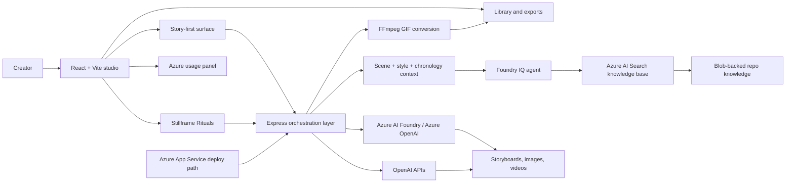

# Hyroglyphs


**Story-first creative AI studio for surreal worlds, ritual stillframes, storyboard-driven motion, and remixable or extendable video loops.**

Prepared as a submission candidate for the Microsoft Agents League Contest @ AI Skills Fest 2026 under the Creative Apps track.

## Submission Snapshot

Hyroglyphs is being prepared for the Microsoft Agents League Contest @ AI Skills Fest. Based on the official contest rules and contest repository guidance, a valid submission must include a working project, a public GitHub repository, a project description, an architecture diagram, and a public demo video no longer than 5 minutes.

Relevant source material:

- [Agents League Contest README](https://github.com/microsoft/Agents-League-AISF-Regulations/blob/main/README.md)
- [Official Rules](https://github.com/microsoft/Agents-League-AISF-Regulations/blob/main/OFFICIAL%20RULES.md)
- [Disclaimer](https://github.com/microsoft/Agents-League-AISF-Regulations/blob/main/DISCLAIMER.md)
- [Code of Conduct](https://github.com/microsoft/Agents-League-AISF-Regulations/blob/main/CODE%20OF%20CONDUCT.md)

| Submission item | Status | Notes |
| --- | --- | --- |
| Creative Apps track fit | Ready | Creator-facing application with AI-assisted ideation, visual generation, and iteration |
| Working project | Ready | `npm run build` passes |
| Public source repository | Ready | This repository |
| Project description | Ready | This README |
| Architecture diagram | Ready | Included below |
| Microsoft IQ integration | Ready | Foundry IQ grounding is integrated and documented |
| Demo video (5 minutes max) | Pending | Add your final YouTube or Vimeo link before submission |
| Team metadata | Pending if needed | Add team members and Microsoft Learn usernames in the contest submission form if applicable |

Demo video link: Add your final public YouTube or Vimeo URL here before submitting.

## What Hyroglyphs Is

Hyroglyphs is a creative application for building visual worlds in a story-first way. Instead of treating prompt generation, visual direction, and motion as separate tasks, it keeps them in one iterative studio loop:

1. Generate or refine story concepts.
2. Break them into structured scenes.
3. Ground the creative intent with Foundry IQ or curated local knowledge.
4. Turn scenes into stillframes, sketches, GIF loops, or video clips.
5. Keep iterating through remix and extension flows instead of restarting from scratch.

The project is centered on the ARV aesthetic language: dark analog archive textures, sparse compositions, controlled motion, and loop-ready visual payoffs.

## Why This Fits the Creative Apps Track

Hyroglyphs is positioned for the Creative Apps track because it is a creator-facing product, not just a backend demo:

- It supports ideation, art direction, prompt shaping, rendering, and iteration in one interface.
- It turns multi-step AI orchestration into something visual and demoable in minutes.
- It uses Microsoft IQ as a real creative intelligence layer instead of a decorative add-on.
- It exposes remix and extension workflows that feel native to artists, motion designers, and creative technologists.
- It is designed to be judged as a polished application experience, not only as an API experiment.

## Core Product Experience

### 1. Story-first studio

The main studio surface focuses on creative sequencing rather than one-off prompt firing. Story concepts can become structured scenes with continuity, pacing, and visual identity carried forward across the sequence.

### 2. Stillframe Rituals

Stillframe Rituals is a focused creation surface for four-beat visual loops. It supports:

- idea generation
- prompt polishing
- sketch generation
- video-to-GIF conversion
- video remix
- video extension
- reference DNA from uploaded images

### 3. Story scene rendering

Story scenes can be rendered with grounded prompts, stored with their resulting assets, and revisited later. The app tracks source video IDs for derivative flows so creators can iterate instead of re-rolling from zero.

### 4. Foundry IQ grounding

Hyroglyphs integrates Foundry IQ as the required Microsoft IQ layer. Scene requests can be enriched with context such as:

- story title and concept
- scene chronology
- style preset IDs
- reference palette and motion DNA
- source video ID for remix or extension

That context is turned into a grounded prompt brief before rendering, helping maintain style consistency, continuity, and safer iteration.

### 5. Library and export surface

Generated ideas, GIFs, and story outputs can be stored in the in-browser library for replay, export, and follow-up iterations.

### 6. Azure usage visibility

The studio includes an Azure usage panel so a demo can show not only output generation but also the operational footprint of the workflow.

## Microsoft Stack and AI Usage

Hyroglyphs intentionally combines creative generation with Microsoft platform depth.

| Layer | Role in Hyroglyphs |
| --- | --- |
| GitHub Copilot / Creative Apps track | Submission category alignment for AI-assisted app development |
| Microsoft Foundry IQ | Required Microsoft IQ layer for grounded, cited prompt context |
| Azure AI Foundry Inference | Text and image orchestration in Foundry-backed flows |
| Azure OpenAI / Azure video endpoints | Video generation, remix, and extension in Azure-backed flows |
| Azure AI Search + Storage | Knowledge base backbone for Foundry IQ export and retrieval |
| OpenAI APIs | Parallel text, image, and video provider path for flexible local demos |
| FFmpeg | Final video-to-GIF conversion for shareable visual loops |
| Azure App Service | Included deployment target for public hosting |

Optional provider hooks for Gemini and Fal AI are still present in the repository, but the primary contest narrative for this project is the Foundry/OpenAI creative workflow grounded by Foundry IQ.

## How Foundry IQ Is Used

Foundry IQ is not just mentioned for compliance. It is wired into the prompt-building path.

High-level flow:

1. The UI sends a structured scene context.
2. The server normalizes that context into an IQ query.
3. A remote Foundry IQ agent is used when configured.
4. If the remote agent is unavailable, Hyroglyphs falls back to curated local knowledge from repo documents.
5. The resulting brief is injected into the final model prompt before rendering.

This means the app can preserve:

- stylistic continuity
- visual constraints
- scene chronology
- narrative coherence
- safer drift boundaries during remix and extension

## ARV Thumbnail Studio

The ARV Thumbnail Studio is a dedicated surface (route `/thumbnail-studio`) that auto-generates a title, theme, full YouTube metadata, and a final 16:9 thumbnail for the next Audioreworkvisions livestream.

The central idea: **the app does not just generate random titles and thumbnails — it uses Azure AI Foundry IQ as a Creative Brand Memory.** Before generating, the studio retrieves curated ARV style rules, past thumbnail patterns, negative rules, and prompt-DNA from Foundry IQ, and the UI shows exactly which memory and knowledge sources influenced each creative decision (the **Foundry IQ Memory Used** and **Creative Decision Explanation** panels).

### What it does

1. **Reference analysis** — Analyzes a folder of past thumbnails (server-side) or uploaded images, extracting dominant colors, brightness, contrast, composition patterns, and semantic hints, then builds a reusable ARV style profile.
2. **Creative Brand Memory retrieval** — Queries Foundry IQ (with a graceful local-knowledge fallback) for style rules, recurring patterns, dramaturgy, and negative rules.
3. **Concept generation** — Produces title variants with scores, a recommended title, theme, YouTube title/description, hashtags, SEO keywords, layout, palette, a background prompt (text-free) and a negative prompt.
4. **Background generation** — Optionally generates a 16:9 background via Azure image generation, or you can upload your own.
5. **Local title rendering** — Composes the final 1920×1080 thumbnail locally with `sharp` + an SVG overlay, so the exact, intended title text is always rendered crisply (never garbled by an image model). Includes the fixed ARV slogan `PEACE LOVE TECHNO` and the `TECHNO TRANSMISSIONS` topline.
6. **Memory write-back** — Saves the session as a memory card so future generations can learn what worked.

### Three fallback tiers

The studio is fully usable even without any cloud configuration:

- **Tier 1 — Full Azure demo**: Foundry IQ + Azure text + Azure image all configured.
- **Tier 2 — Text-only Azure**: title/concept via Azure, upload your own background.
- **Tier 3 — Offline fallback**: local title pools, local style profile, and local rendering only.

### Environment variables

```bash
ARV_THUMBNAIL_DATA_DIR=data/thumbnail-studio          # storage root for profiles, sessions, exports
ARV_THUMBNAIL_DEFAULT_REFERENCE_DIR=                  # optional default server folder of reference thumbnails
```

It also reuses the existing Azure / Foundry IQ variables (`AZURE_AI_FOUNDRY_*`, `AZURE_OPENAI_*`, `AZURE_FOUNDRY_IQ_AGENT_NAME`, `HYROGLYPHIS_IQ_PROVIDER`, `OPENAI_API_KEY`).

### Storage locations

- `data/thumbnail-studio/style-profiles/` — generated ARV style profiles
- `data/thumbnail-studio/sessions/` — saved generation sessions
- `data/thumbnail-studio/exports/` — rendered thumbnail PNGs
- `memories/thumbnail-studio/` — human-readable memory cards (markdown)

### Syncing memory into Foundry IQ

To promote saved sessions into Foundry IQ long-term memory, run from the repo root:

```powershell
./scripts/sync-thumbnail-memory.ps1
```

This uploads the markdown memory cards into the existing Foundry IQ knowledge container (`knowledge/kb`); the existing knowledge base indexes them on its next run. The script reads `.env.local`/`.env` automatically to resolve the Azure key. Pass `-RecreateKnowledgeBase` to also redefine the knowledge source/base via `infra/foundry-iq/scripts/sync-search-kb.ps1`.

### Demo flow

1. Open `/thumbnail-studio`.
2. Click **Referenzen analysieren** to build a style profile.
3. Click **Foundry IQ Memory abrufen** and review the **Foundry IQ Memory Used** panel.
4. Click **Neues Konzept generieren** and read the **Creative Decision Explanation**.
5. Generate or upload a background, then **Thumbnail rendern**.
6. **Export PNG** / **Export JSON**, and optionally **In Memory speichern**.

## Architecture Diagram

The contest rules require an architecture diagram. The diagram below is included specifically so the repository is submission-ready.



## Judging Rubric Alignment

The official contest judging rubric weights accuracy, reasoning, creativity, UX, reliability, and community vote. This repository is now documented to make those strengths visible.

| Judging area | How Hyroglyphs addresses it |
| --- | --- |
| Accuracy and relevance (20%) | A working creative app with a clear creator workflow, documented setup, and submission-oriented README |
| Reasoning and multi-step thinking (20%) | Story-to-scene orchestration, chronology-aware context, IQ grounding, and derivative video transforms |
| Creativity and originality (15%) | Distinct ARV visual language, ritual loop structure, and story-first creative UX |
| User experience and presentation (15%) | Separate creation surfaces, library, debug visibility, and demo-friendly flows |
| Reliability and safety (20%) | Public-safe repo guidance, environment-variable secrets, local IQ fallback, and validated build |
| Community vote (10%) | README, architecture, and demo plan are structured for clear public presentation |

## Repository Walkthrough

Important entry points:

- [App shell](./App.tsx) - top-level routing between story studio, stillframe, library, and usage views
- [Stillframe Rituals](./components/StillframeHarness.tsx) - four-beat stillframe and loop workflow
- [Story mode](./components/StoryMode.tsx) - multi-scene story generation and rendering workflow
- [Library](./components/Library.tsx) - saved outputs and reuse surface
- [Server entry](./server/index.ts) - Express + Vite server bootstrap
- [IQ orchestration](./server/utils/iq.ts) - Foundry IQ and local fallback grounding
- [Foundry service](./services/foundryService.ts) - Azure AI Foundry and Azure video integration
- [Foundry IQ infra export](./infra/foundry-iq/README.md) - reusable infrastructure for the knowledge layer
- [Azure App Service deploy path](./infra/appservice/README.md) - deployment scaffolding for public hosting

## Local Development

### Prerequisites

- Node.js 22+
- npm
- Access to at least one generation provider
- Optional Azure resources if you want the full Foundry IQ path

### 1. Install dependencies

```bash
npm install
```

### 2. Create local environment config

Start from [.env.example](./.env.example):

```bash
cp .env.example .env.local
```

On Windows PowerShell you can copy it manually or duplicate the file in Explorer.

### 3. Choose a runtime profile

#### Minimal OpenAI profile

Use this if you want the simplest local boot path:

```env
OPENAI_API_KEY=your_openai_key
```

#### Recommended contest demo profile

Use this if you want the Microsoft IQ and Azure-backed story path that best matches the submission narrative:

```env
AZURE_AI_FOUNDRY_ENDPOINT=...
AZURE_AI_FOUNDRY_KEY=...
AZURE_EXISTING_AIPROJECT_ENDPOINT=...
AZURE_OPENAI_KEY=...
AZURE_VIDEO_ENDPOINT=...
AZURE_VIDEO_KEY=...
HYROGLYPHIS_IQ_PROVIDER=auto
AZURE_FOUNDRY_IQ_AGENT_NAME=...
AZURE_FOUNDRY_IQ_AGENT_VERSION=...
```

### 4. Start the app

```bash
npm run dev
```

The Express server also hosts the Vite app and will bind to the first free port starting at `4173` unless a port is explicitly provided.

### 5. Validate production build

```bash
npm run build
```

### 6. Run the production server locally

```bash
npm start
```

## Environment Variables

Not every variable is required at once. The repository supports multiple provider shapes.

### Core OpenAI variables

- `OPENAI_API_KEY`
- `OPENAI_TEXT_MODEL`
- `OPENAI_STORYBOARD_MODEL`
- `OPENAI_IMAGE_MODEL`
- `OPENAI_VIDEO_MODEL`

### Azure AI Foundry / Azure OpenAI variables

- `AZURE_AI_FOUNDRY_ENDPOINT`
- `AZURE_AI_FOUNDRY_KEY`
- `AZURE_AI_FOUNDRY_MODEL`
- `AZURE_AI_FOUNDRY_API_VERSION`
- `AZURE_AI_FOUNDRY_IMAGE_MODEL`
- `AZURE_EXISTING_AIPROJECT_ENDPOINT`
- `AZURE_OPENAI_COMPLETIONS_KEY`
- `AZURE_OPENAI_COMPLETIONS_MODEL`
- `AZURE_OPENAI_ENDPOINT`
- `AZURE_OPENAI_KEY`
- `AZURE_OPENAI_API_VERSION`
- `AZURE_OPENAI_TEXT_MODEL`
- `AZURE_OPENAI_STORYBOARD_MODEL`
- `AZURE_OPENAI_POLISH_MODEL`
- `AZURE_OPENAI_VISION_MODEL`
- `AZURE_OPENAI_IMAGE_DEPLOYMENT`
- `AZURE_OPENAI_VIDEO_DEPLOYMENT`
- `AZURE_VIDEO_ENDPOINT`
- `AZURE_VIDEO_KEY`
- `AZURE_VIDEO_MODEL`

### Foundry IQ variables

- `HYROGLYPHIS_IQ_PROVIDER`
- `AZURE_FOUNDRY_IQ_AGENT_NAME`
- `AZURE_FOUNDRY_IQ_AGENT_VERSION`
- `AZURE_OPENAI_IQ_MODEL`

### Optional provider hooks

- `API_KEY` or `GEMINI_API_KEY`
- `FAL_KEY`

## Deployment

Hyroglyphs already includes infrastructure and deployment scaffolding for a public Azure-hosted submission.

- Azure App Service path: [infra/appservice/README.md](./infra/appservice/README.md)
- Foundry IQ export: [infra/foundry-iq/README.md](./infra/foundry-iq/README.md)

The repository includes:

- App Service Bicep templates
- example app settings
- a deploy helper script
- a resilient startup script
- a reusable Foundry IQ export with infra and sync helpers

## Submission Checklist

Use this list before you create the final contest entry:

- [x] Working project
- [x] Public GitHub repository with source code
- [x] README with project description, setup instructions, and architecture
- [x] Architecture diagram included in the repository
- [x] Microsoft IQ integration documented and wired into the product
- [x] Local and deployment guidance documented
- [ ] Add final public demo video link (5 minutes max)
- [ ] Verify all visual, audio, and video assets are original or properly licensed for public release
- [ ] Verify no secrets, tokens, internal notes, or customer data are present in the repository
- [ ] Add team member info and Microsoft Learn usernames in the submission form if applicable
- [ ] Do a final walkthrough against the official rules and disclaimer before submitting

## Security, IP, and Public-Repo Hygiene

The contest rules and disclaimer make public-release hygiene non-negotiable. Before submitting:

- do not commit credentials, tokens, or secrets
- do not publish confidential, internal, or proprietary material
- do not include copyrighted third-party assets unless you have permission
- make sure the demo video is your own original work and stays within the 5-minute limit
- keep `.env.local` local and out of version control

Hyroglyphs is intended to be presented from a public-safe repository state.

## Recommended 5-Minute Demo Flow

If you are preparing the contest video next, this is a practical sequence:

1. Open the story-first studio and explain the creative problem Hyroglyphs solves.
2. Generate or refine a story concept.
3. Show how scene context is grounded with Foundry IQ.
4. Render a stillframe or story scene.
5. Jump into Stillframe Rituals and show idea generation or reference DNA.
6. Demonstrate video remix and video extension from an existing clip.
7. Open the library to show saved outputs.
8. End on the architecture diagram and the Microsoft IQ explanation.

## Current Validation Status

Current repo validation command:

```bash
npm run build
```

This command runs TypeScript checking, the Vite frontend build, and the bundled server build.

## Closing Note

Hyroglyphs is not presented as a generic prompt playground. It is a creative application with a distinct aesthetic system, a story-first workflow, grounded intelligence through Foundry IQ, and a demo-friendly product surface prepared for public contest submission.
