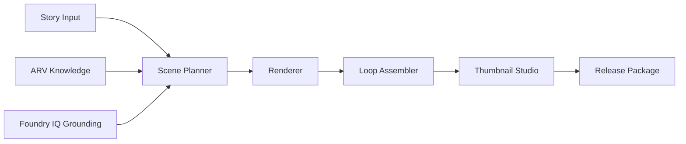

# ARV Hyroglyphs Demo Run Show Notes

This document tracks the demo run in sync with [data/obs/demo_tell_timeline.json](../../data/obs/demo_tell_timeline.json).

## Runtime target

- Total length: 4:40 to 4:50
- Trigger source: OBS script [obs_ai_visual.py](../../obs_ai_visual.py)
- Overlay mode: silent tell slides, no spoken audio required

## Slide timeline (SHOW + TELL)

| Time | Slide title | SHOW (operator action) | TELL (overlay text) |
| --- | --- | --- | --- |
| 00:00 | Intro: Stop Prompt Roulette | Hard cut to clean ARV loop, dark archive texture, sparse composition. | Hyroglyphs is a story-first creative AI studio for @audioreworkvisions, built for repeatable coherent visual worlds. |
| 00:18 | Start with narrative | New Release screen, click Create from Story. | Instead of one-off images, we turn a concept into structured scene beats you can iterate, remix, and extend. |
| 00:36 | Audience framing | Slide: Built for Hackathon Judges and Builders. | This demo focuses on end-to-end pipeline, remix continuity, and packaging automation. |
| 00:52 | Pipeline 1: Concept | Generate/Refine Story Concept panel. | Step 1: Generate or refine a story concept for the release. |
| 01:14 | Pipeline 2: Scene beats | Click Break into Scene Beats, show Beat 1 to Beat 6. | Step 2: Convert story into scene beats, a plan you can reuse. |
| 01:36 | Pipeline 3: Grounding | Show Foundry IQ plus Local ARV Knowledge toggles and labels. | Step 3: Ground creative intent using Foundry IQ plus curated channel knowledge so outputs stay on-brand. |
| 02:02 | Pipeline 4: Render | Click Render Scenes, show four loopable GIF outputs. | Step 4: Render stillframes, sketches, and loopable GIF scenes ready for iteration. |
| 02:26 | Assemble slideshow | Click Assemble Slideshow and preview continuous visual source. | Result: concept to plan to 4 loops to slideshow, ready for a music video or livestream. |
| 02:46 | Remix flow start | Open Existing Release and select prior release. | Now we remix: take an existing release story and scenes and extend the same world. |
| 03:08 | Remix continuity | Click Generate Remix Pack, show A/B original vs remix loops. | Hyroglyphs creates new loops that stay coherent, no restarting from scratch. |
| 03:28 | Structured iteration | Show Remix, Extend Beat, Variant with constraints controls. | The key shift: iteration is structured. Remix and extend flows replace random re-prompting. |
| 03:48 | Thumbnail studio | Open Thumbnail Studio with thumbnail, title, metadata and SEO fields. | Thumbnail Studio generates the release package, grounded in the same narrative and style. |
| 04:08 | System architecture | Show architecture slide. | Repeatable system: narrative to structure to grounded generation to loop outputs to packaging. |
| 04:28 | Impact and placeholders | Show Speed, Consistency, Scale with metric placeholders. | Impact: faster shipping, consistent identity, scalable workflow. |

## Architecture diagram slide content

## Placeholder metrics for impact slide

- Hours saved per release: TBD
- Releases per week: TBD
- Iteration count per release: TBD

## OBS operator quick steps

1. Load [obs_ai_visual.py](../../obs_ai_visual.py) in OBS Scripts.
2. Open dock at http://localhost:18888.
3. In Demo Tell Slides panel click Reload, then Play.
4. Run the UI demo flow in parallel with this timeline.
5. Use Next/Prev for live recovery if the pace drifts.
